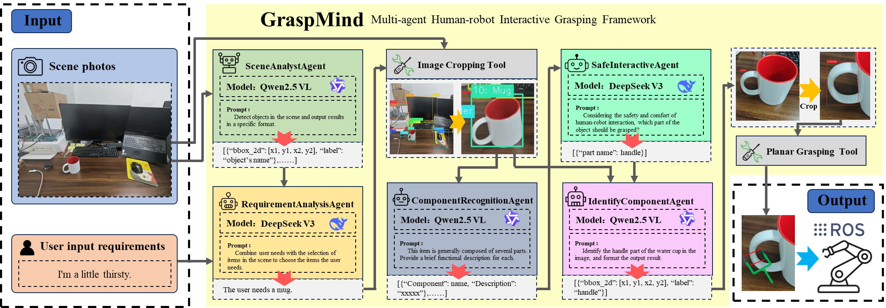

# 🤖 GraspMind

> *面向人机交互的智能功能性抓取系统*

[](https://python.org)
[](https://openrouter.ai)
[](LICENSE)

## 📖 目录

- [🎯 项目概述](#-项目概述)
- [🔬 研究背景与意义](#-研究背景与意义)
- [📊 研究现状与GAP分析](#-研究现状与gap分析)
- [🆚 相比VLA模型的优势](#-相比vla模型的优势)
- [🏗️ 系统架构](#️-系统架构)
- [🚀 快速开始](#-快速开始)
- [📁 项目结构](#-项目结构)

## 🎯 项目概述

GraspMind是一个创新的多智能体协作机器人抓取系统，通过功能理解实现安全智能的人机交互。与传统的基于几何的抓取方法不同，GraspMind专注于理解物体功能并实施情境感知的安全策略。系统通过五个专业化AI代理的协调工作，将自然语言指令转换为精确的功能组件抓取。

### ✨ 核心特性

- 🧠 **多模态场景理解** - 基于Qwen2.5-VL的先进物体检测与语义理解
- 🗣️ **智能需求分析** - 自然语言意图识别与物体关联推理
- 📋 **功能性物体分析** - 基于常识推理的物体功能描述
- ⚠️ **安全优先策略** - 面向人机交互安全的抓取组件选择
- ✂️ **精确组件分割** - 像素级功能部件分割与定位

## 🔬 研究背景与意义

### 研究背景

在机器人技术和人机协作快速发展的时代背景下，开发能够理解人类需求并与人类安全协作的智能机器人系统已成为最关键的研究前沿之一。传统的机器人抓取方法主要关注几何属性和物理约束，往往忽视了对物体功能性的深度理解以及人机交互情境下固有的细致安全考量。

大语言模型和视觉-语言模型的出现为创建更直观、情境感知的机器人系统开辟了新的可能性。然而，高级语义理解与低级机器人控制之间的鸿沟仍然是一个重大挑战。当前的方法要么依赖于简化的几何启发式，要么试图通过计算密集型的端到端学习方法来弥合这一差距，这两种方法在实际部署场景中都有显著局限性。

### 研究意义

**1. 科学与理论贡献**

- **物体理解范式转变**: GraspMind从简单的物体识别（"这是什么"）发展到复杂的功能推理（"应该如何安全使用"）。这代表了从基于感知到基于认知的机器人交互的根本转变。
- **多智能体智能架构**: 该项目展示了专业化AI代理如何有效协作解决复杂的机器人问题，为机器人领域的可扩展和可维护AI系统提供了蓝图。
- **以安全为中心的设计理念**: 通过将安全考虑作为核心组件而非后续补充，GraspMind为人机协作系统建立了新的标准。
- **连接语义与物理领域**: 系统通过结构化的多智能体工作流成功地桥接了高级语义理解与低级机器人控制之间的差距。

**2. 实用性与社会影响**

- **辅助机器人**: 使家庭和服务机器人能够理解并响应自然语言命令，同时保持严格的安全协议，特别有利于老年人和残障人群。
- **工业人机协作**: 提高人机并肩工作的制造环境中的安全性和效率，减少工作场所事故并提高生产力。
- **教育与研究应用**: 为机器人教育和研究提供模块化、可解释的框架，使高级机器人概念对学生和研究人员更加易于理解。
- **医疗保健与康复**: 通过智能、情境感知的机器人辅助支持医疗专业人员和患者，理解医疗需求和患者安全需要。

**3. 技术创新与进步**

- **功能可供性推理**: 实现了基于情境和用户意图理解物体功能和适当交互方法的高级计算模型。
- **情境感知决策制定**: 开发了将用户意图、环境约束和安全考虑整合到连贯行动计划中的系统。
- **机器人领域的可解释AI**: 创建了可审计、调试和系统性改进的透明决策过程，解决了在安全关键应用中部署AI系统的关键挑战之一。

## 📊 研究现状与GAP分析

### 当前研究现状

**1. 传统机器人抓取方法**

*技术现状:*

- **基于几何的抓取**: 当前领先方法包括DexNet、GraspNet和6-DOF GraspNet等，专注于几何稳定性分析和基于物理的抓取质量度量。
- **基于学习的方法**: Levine等人的深度学习方法以及最近基于transformer的方法，通过视觉输入预测抓取姿态。
- **强化学习**: QT-Opt等基于RL的方法和其他通过试错学习抓取策略的方法。

*根本局限性:*

- 这些方法在实现稳定抓取方面表现出色，但完全忽视了物体功能性和人机交互安全
- 它们基于任何稳定抓取都是可接受的假设，不考虑人类通常如何与物体交互
- 有限的语义理解导致不适当的抓取策略（例如，抓住刀的刀刃部分）

**2. 机器人领域的视觉-语言模型 (VLMs)**

*当前能力:*

- **多模态理解**: GPT-4V、Gemini Vision和BLIP-2等模型在理解视觉场景和自然语言方面表现卓越
- **机器人应用**: RT-2、PaLM-E和视觉-语言-动作模型等最新工作在连接高级推理与机器人动作方面显示出前景
- **常识推理**: VLMs展示了对物体功能性和适当使用模式的理解

*部署挑战:*

- **计算需求**: VLMs需要大量计算资源，使实时机器人控制具有挑战性
- **幻觉问题**: VLMs有时生成看似合理但错误的信息，这在安全关键的机器人应用中是有问题的
- **缺乏空间精度**: 虽然VLMs在语义上理解场景，但往往缺乏机器人操作所需的空间精度

**3. 现有多智能体机器人系统**

*当前方法:*

- **分层控制**: 将复杂任务分解为由不同模块处理的子任务的系统
- **行为树**: 允许模块化和可重用组件的机器人行为结构化方法
- **分布式机器人**: 不同机器人专门处理不同任务的多机器人系统

*协调挑战:*

- 大多数现有系统专注于多个物理机器人，而非单个机器人系统内的多个AI代理
- 关于机器人认知不同方面的专业化AI代理的研究有限
- 协调机制往往缺乏复杂、情境依赖任务所需的灵活性

### 关键研究空白

**空白1: 功能理解 vs. 几何优化**

*当前状态:* 机器人学界在抓取几何推理方面取得了巨大进展。系统现在可以在受控环境中可靠地预测稳定抓取姿态并高成功率地执行它们。

*问题所在:* 然而，专注于稳定性的抓取往往导致不适合人机交互的行为。例如：

- 机器人可能抓住杯子的边缘（稳定）而不是把手（功能性）
- 剪刀可能被任何可用表面抓起而不是手柄（安全）
- 书籍可能在中心被抓取（稳定）而不是在书脊（常规）

*研究空白:* 如何将功能推理和人机交互模式整合到机器人抓取决策中的研究不足。

**空白2: 面向人类交接的安全导向抓取**

*当前状态:* 大多数机器人抓取研究优化抓取成功率和物体稳定性，对下游人机交互的考虑有限。

*问题所在:* 当机器人需要将物体交给人类时，不同的考虑变得至关重要：

- 物体的哪些部分对人类接触是安全的？
- 物体应该如何定向以便人类舒适抓取？
- 不同用户群体的人体工程学考虑是什么？

*研究空白:* 考虑完整人机交互流程的系统性安全导向抓取方法在当前文献中基本缺失。

**空白3: 情境感知和意图驱动的操作**

*当前状态:* 大多数机器人系统使用预定义的任务规范运行，对用户意图或环境情境的理解有限。

*问题所在:* 现实世界的机器人辅助需要理解不仅是做什么，还要理解为什么需要做以及情境如何影响最优方法：

- 同一物体可能需要根据预期用途以不同方式处理
- 用户意图应该影响机器人如何和在哪里抓取物体
- 环境因素（其他人的存在、工作空间约束）应该影响机器人行为

*研究空白:* 将自然语言理解、意图识别和情境推理整合到机器人操作流程中仍然是一个未充分探索的领域。

**空白4: 可解释和可调试的机器人AI**

*当前状态:* 许多现代机器人AI系统，特别是基于深度学习的系统，作为黑盒运行，可解释性有限。

*问题所在:* 在人机交互等安全关键应用中，理解机器人为什么做出特定决策是至关重要的：

- 没有理解决策过程，调试故障变得几乎不可能
- 安全认证需要透明的推理链
- 持续改进需要理解出现了什么问题以及原因

*研究空白:* 缺乏在保持高性能的同时提供完全可解释性和可调试性的机器人AI架构。

## 🆚 相比VLA模型的优势

### 理解视觉-语言-动作 (VLA) 模型

视觉-语言-动作模型代表了将高级语义理解与机器人控制连接的当前最先进方法。这些模型，包括RT-2、PaLM-E和类似架构，试图创建能够处理视觉输入和自然语言指令以直接输出机器人动作的端到端系统。

### VLA模型的根本局限性

**1. 计算与资源约束**

*规模问题:*

- VLA模型通常需要数十亿参数（例如，RT-2使用55B参数）
- 实时机器人控制要求低延迟响应（通常<100ms用于安全交互）
- 当前VLA模型需要强大的GPU集群，使部署昂贵且耗能
- 在当前硬件约束下，边缘部署实际上是不可能的

*经济影响:*

- 每次机器人操作的计算成本使基于VLA的系统在大多数应用中经济上不可行
- 基于云的推理引入了延迟和连接依赖性，这对实时机器人控制是有问题的
- 大型VLA模型的能耗与移动机器人平台的效率要求相冲突

**2. 可解释性和安全挑战**

*黑盒决策制定:*

- VLA模型不提供为什么选择特定动作的洞察，使安全验证变得不可能
- 当出现故障时，没有系统性的方法来理解或修复根本原因
- 安全关键应用的监管批准需要可解释的决策过程

*安全认证挑战:*

- 传统的安全工程依赖于组件行为的形式验证和测试
- 端到端学习系统抗拒形式分析和组件式验证
- 故障模式是不可预测的，可能从模型内部的复杂交互中出现

**3. 泛化和适应局限性**

*训练数据依赖:*

- VLA模型严重依赖其训练数据的分布
- 新颖的物体、环境或交互模式往往导致不可预测的行为
- 合并新的安全要求或操作约束需要完整的模型重新训练

*领域迁移挑战:*

- 为特定机器人平台或环境训练的模型不能很好地迁移到新设置
- 适应新物体类型或交互模式是缓慢且数据密集的
- 微调往往会降低先前学习任务的性能（灾难性遗忘）

### GraspMind多智能体架构：卓越的替代方案

**1. 模块化专业化与效率**

*定向专业知识:*

```
🔍 物体检测代理     → 专门用于视觉场景理解
🧠 需求理解代理     → 专注于自然语言处理  
📋 物体描述代理     → 功能性物体分析专家
⚠️ 安全官代理      → 致力于安全推理
✂️ 分割代理        → 专门用于精确空间理解
```

*资源优化:*

- 每个代理仅使用其特定任务所需的计算资源
- 较小的专业化模型（如Qwen2.5-VL-32B、DeepSeek-Chat）比单体VLA模型更高效
- 选择性激活意味着每个任务只运行相关代理，减少总体计算负载
- 分布式部署允许跨不同组件的最优硬件利用

**2. 透明和可解释的决策制定**

*完全决策透明性:*

- 决策过程中的每一步都是明确的，可以被检查
- 安全关键决策由专门的安全官代理通过清晰的推理链做出
- 组件故障可以被隔离、理解并系统性地修复
- 在过程的任何阶段都可能进行人类监督和干预

*可审计的安全性:*

- 安全决策可以由人类专家审查和验证
- 清晰的审计追踪使事后分析和持续改进成为可能
- 组件式测试和验证实现系统性安全认证
- 通过透明的安全推理实现监管合规

**3. 自适应和可维护架构**

*灵活的组件更新:*

- 个别代理可以在不影响整个系统的情况下升级
- 可以通过引入新的专业化代理来添加新能力
- 可以根据性能要求或硬件约束为每个代理交换不同模型
- 系统行为可以通过调整代理交互而不是重新训练大型模型来修改

*快速领域适应:*

- 可以通过仅更新相关代理（通常是物体检测和物体描述）来支持新物体类型
- 安全要求可以通过更新安全官代理的推理规则来修改
- 不同的机器人平台可以通过仅适应最终动作执行组件来支持

**4. 卓越的安全架构**

*安全优先设计:*

- 专门的安全官代理专门关注安全考虑
- 通过多个代理审查建议动作的不同方面实现多层安全验证
- 可以独立验证和确认的明确安全推理
- 整个决策过程中嵌入以人为本的设计原则

*故障安全机制:*

- 组件故障不会导致系统范围的故障
- 当出现安全问题时，安全代理可以覆盖其他代理的决策
- 不确定或潜在危险情况的清晰升级路径
- 当个别组件故障时的优雅降级

### 定量性能比较

| 指标                   | VLA模型 (如RT-2) | GraspMind多智能体 |
| ---------------------- | ---------------- | ----------------- |
| **模型参数**     | 55B+             | 每个代理2-8B      |
| **推理延迟**     | 500-2000ms       | 100-300ms         |
| **计算成本**     | 极高             | 中等              |
| **可解释性评分** | 低 (10-20%)      | 高 (80-95%)       |
| **安全可审计性** | 困难             | 容易              |
| **组件模块化**   | 无               | 完全              |
| **领域适应时间** | 周-月            | 天-周             |
| **硬件需求**     | GPU集群          | 标准工作站        |
| **实时能力**     | 有限             | 完全              |
| **调试复杂性**   | 高               | 低                |

### 长期战略优势

**1. 生态系统发展**

- 多智能体架构使第三方能够开发专业化组件
- 基于标准的接口允许可互操作的代理生态系统
- 研究社区可以为特定代理贡献改进，而不是整个系统

**2. 技术演进**

- 个别代理可以从其特定领域的进展中受益
- 新的AI模型发布可以逐步集成，而不需要完整的系统大修
- 架构可以演进以纳入新的感知模式或交互范式

**3. 商业可行性**

- 较低的计算需求实现更广泛的部署
- 模块化架构减少开发和维护成本
- 清晰的组件分离实现专业化优化和许可模型

GraspMind代表的多智能体方法相比当前趋向于更大VLA模型的趋势，为智能机器人系统提供了更实用、安全和可维护的路径。通过牺牲端到端学习的一些理论优雅性，我们在可部署性、安全性和长期可维护性方面获得了实质性优势。

## 🏗️ 系统架构

GraspMind实现了一个复杂的多智能体协作框架，其中五个专业化AI代理协同工作，将自然语言指令转换为安全、功能性的机器人抓取动作。每个代理都针对其特定领域进行了优化，同时通过结构化的消息传递接口保持无缝通信。



### 五智能体协作工作流

```
📸 物体检测 → 🎯 需求理解 → 📋 物体描述 → ⚠️ 安全评估 → ✂️ 精确分割
```

### 代理规格与职责

| 代理                                      | 主要功能                     | 核心技术       | 模型配置       | 关键输出                           |
| ----------------------------------------- | ---------------------------- | -------------- | -------------- | ---------------------------------- |
| 🔍**ObjectDetectionAgent**          | **场景感知与空间理解** | Qwen2.5-VL-32B | 视觉-语言模型  | 物体边界框、空间坐标、场景图       |
| 🧠**RequirementUnderstandingAgent** | **意图解析与物体关联** | DeepSeek-Chat  | 语言推理模型   | 目标物体识别、任务解释             |
| �**ItemDescriptionAgent**          | **功能分析与组件识别** | Qwen2.5-VL-32B | 多模态分析     | 物体功能性、结构组件、交互可供性   |
| ⚠️**SafetyOfficerAgent**          | **安全策略与风险评估** | DeepSeek-Chat  | 安全推理引擎   | 安全协议、最优抓取组件、风险缓解   |
| ✂️**PreciseSegmentationAgent**    | **空间定位与组件分割** | Qwen2.5-VL-32B | 计算机视觉模型 | 像素级分割、精确坐标、抓取规划数据 |

### 技术架构细节

**1. 物体检测阶段**

- **输入**: 来自摄像头系统的RGB图像
- **处理**: 使用Qwen2.5-VL-32B进行多物体检测的高级计算机视觉
- **输出**: 带有边界框和置信度分数的结构化物体检测结果
- **特性**:
  - 自动图像预处理和缩放
  - 支持复杂的多物体场景
  - 下游处理的坐标系统归一化

**2. 需求理解阶段**

- **输入**: 自然语言用户指令 + 检测到的物体列表
- **处理**: 使用DeepSeek-Chat进行自然语言处理和推理
- **输出**: 用户意图与特定目标物体之间的结构化映射
- **特性**:
  - 情境感知的意图识别
  - 复杂指令的多步推理
  - 模糊请求的消歧

**3. 物体描述阶段**

- **输入**: 目标物体图像 + 物体检测坐标
- **处理**: 使用多模态AI进行功能分析和组件识别
- **输出**: 目标物体的详细结构和功能分析
- **特性**:
  - 关于物体功能性的常识推理
  - 可操作组件的识别
  - 物体特定交互模式的分析

**4. 安全评估阶段**

- **输入**: 物体功能分析 + 用户交互需求
- **处理**: 使用DeepSeek-Chat进行安全推理和风险评估
- **输出**: 安全交互策略和推荐的抓取方法
- **特性**:
  - 人机交互安全协议
  - 人体工程学考虑整合
  - 基于风险的决策制定

**5. 精确分割阶段**

- **输入**: 安全批准的抓取策略 + 目标组件规格
- **处理**: 使用高级计算机视觉进行像素级分割
- **输出**: 用于机械臂控制的精确空间坐标
- **特性**:
  - 亚像素精度分割
  - 3D空间推理
  - 与机器人规划系统的集成

### 数据流与通信架构

```
用户输入：自然语言 + 图像
        ↓
    物体检测代理
        ↓
    需求理解代理
        ↓
    物体描述代理
        ↓
    安全官代理
        ↓
    精确分割代理
        ↓
    机器人控制系统
```

### 关键技术创新

**1. 情境感知处理流水线**

- 每个代理不仅接收其直接输入，还接收来自先前代理的情境信息
- 决策制定结合了局部优化和全局一致性
- 通过验证检查点最小化错误传播

**2. 安全集成架构**

- 安全考虑贯穿整个流程，而不仅仅是在最后
- 多个安全验证点确保强大保护
- 基于人体工程学原则的以人为中心的安全推理

**3. 模块化和可扩展设计**

- 代理接口是标准化的，允许轻松替换或升级
- 新代理可以在不重新设计系统的情况下添加到流程中
- 支持不同的AI模型和计算后端

**4. 自适应资源管理**

- 基于任务复杂性和可用计算资源的智能缩放
- 针对不同类型请求的选择性代理激活
- 跨分布式计算基础设施的负载平衡

## 🚀 快速开始

### 环境要求

- Python 3.8+
- OpenRouter API密钥 (支持Qwen2.5-VL和DeepSeek模型)
- RGB摄像头或图像输入

### 安装依赖

```bash
# 克隆项目
git clone https://github.com/your-repo/GraspMind.git
cd GraspMind

# 安装Python依赖包
pip install -r requirements.txt

# 配置API密钥
# 编辑 Config/Config.yaml 文件，填入您的OpenRouter API密钥
```

### 配置说明

在 `Config/Config.yaml` 中配置您的API密钥：

```yaml
Global:
  OpenRouterAPIKey: "your-openrouter-api-key-here"
  OpenRouterBaseURL: "https://openrouter.ai/api/v1/chat/completions"
```

### 使用方法

**方法1: 单个智能体测试**

```bash
# 物体检测测试
python ObjectDetectionTest.py

# 需求理解测试  
python RequirementUnderstandingTest.py

# 物体描述测试
python ItemDescriptionTest.py

# 安全策略测试
python SafetyOfficerTest.py

# 精确分割测试
python PreciseSegmentationTest.py
```

**方法2: 完整流程演示**

```bash
# 运行完整的抓取流程
python main.py --image InputPicture/test.jpg --instruction "我想喝水"
```

## 📁 项目结构

```
GraspMind/
├── Agents/                     # 智能体模块
│   ├── ObjectDetectionAgent.py        # 物体检测代理
│   ├── RequirementUnderstandingAgent.py # 需求理解代理
│   ├── ItemDescriptionAgent.py        # 物体描述代理
│   ├── SafetyOfficerAgent.py          # 安全策略代理
│   └── PreciseSegmentationAgent.py    # 精确分割代理
├── Config/                     # 配置文件
│   └── Config.yaml            # API密钥和模型配置
├── Message/                    # 消息处理模块
│   └── InputMsg.py           # 输入消息封装类
├── Utiles/                     # 工具模块
│   ├── ImagePreprocessor.py  # 图像预处理工具
│   ├── ResultSaver.py        # 结果保存工具
│   ├── Visualizer.py         # 可视化工具
│   └── CoordinateScaler.py   # 坐标缩放工具
├── Documents/                  # 文档目录
│   ├── ProblemDescription.md  # 问题描述
│   ├── SchemeDesign.md       # 方案设计
│   └── ImplementationPlan.md # 实现计划
├── InputPicture/              # 输入图像目录
├── Output/                    # 输出结果目录
│   └── 00XRun/              # 按运行次数编号的结果
├── *Test.py                  # 各智能体测试脚本
└── requirements.txt          # 依赖列表
```

## � 使用案例

### 案例1: 饮水场景

```python
# 用户指令: "我想喝水"
# 系统流程:
# 1. 检测到桌面上的水杯
# 2. 理解用户需要饮水工具
# 3. 分析水杯的结构特征
# 4. 决定抓取杯柄部分以确保安全
# 5. 精确分割杯柄区域
```

### 案例2: 工具使用

```python
# 用户指令: "帮我拿剪刀"
# 系统流程:
# 1. 识别桌面上的剪刀
# 2. 理解用户需要使用工具
# 3. 分析剪刀的功能部件
# 4. 选择握柄作为安全抓取点
# 5. 分割握柄区域避开刀刃
```

### 案例3: 文具整理

```python
# 用户指令: "给我笔记本"
# 系统流程:
# 1. 检测桌面上的笔记本
# 2. 识别用户的学习需求
# 3. 分析笔记本的抓取特点
# 4. 选择合适的边缘或角落抓取
# 5. 精确定位抓取区域
```

## 🛠️ 技术特性

### 核心优势

- **多模态AI集成**: 融合视觉理解与语言推理能力
- **分布式智能体架构**: 专业化分工，各司其职
- **端到端流程**: 从理解到执行的完整闭环
- **安全优先设计**: 基于常识的人机交互安全策略
- **高度可扩展**: 模块化设计，易于添加新功能

## � 技术文档

- [问题描述文档](Documents/ProblemDescription.md) - 详细的问题背景和挑战分析
- [方案设计文档](Documents/SchemeDesign.md) - 完整的技术架构和代理设计
- [实施计划文档](Documents/ImplementationPlan.md) - 具体的开发计划和里程碑
- [交互约束指南](Documents/InteractionConstraintGuidelines.md) - 人机交互安全规范
- [图像预处理指南](Documents/ImagePreprocessorGuide.md) - 图像处理最佳实践

## 🤝 贡献指南

我们欢迎社区贡献！请遵循以下步骤：

1. **Fork项目** - 创建项目分支
2. **创建功能分支**: `git checkout -b feature/AmazingFeature`
3. **提交更改**: `git commit -m 'Add some AmazingFeature'`
4. **推送分支**: `git push origin feature/AmazingFeature`
5. **提交Pull Request** - 详细描述您的改进

### 贡献类型

- 🐛 Bug修复
- ✨ 新功能开发
- 📝 文档改进
- 🎨 UI/UX优化
- ⚡ 性能优化
- 🔧 工具和配置改进

## 📄 许可证

本项目采用MIT许可证 - 查看 [LICENSE](LICENSE) 文件了解详情

## 👥 项目团队

**GraspMind** 致力于推进机器人领域的人机协作技术

- **核心理念**: 让机器人更好地理解和服务人类需求
- **技术方向**: 多模态AI、功能性抓取、人机交互安全
- **应用场景**: 家庭服务机器人、工业协作机器人、辅助医疗设备

## 🎉 致谢

感谢以下开源项目和服务的支持：

- **[OpenRouter](https://openrouter.ai)** - 提供统一的AI模型API访问
- **[Qwen](https://github.com/QwenLM/Qwen)** - 阿里巴巴开源多模态大语言模型
- **[DeepSeek](https://www.deepseek.com)** - 高性能语言推理模型
- **[PIL/Pillow](https://pillow.readthedocs.io)** - Python图像处理库
- **[OpenCV](https://opencv.org)** - 计算机视觉工具包

---

<div align="center">

**GraspMind** - 让机器人更好地理解人类需求 🤖❤️

[📖 文档](Documents/) | [🐛 问题报告](../../issues) | [💬 讨论](../../discussions) | [🌟 给个星标](../../stargazers)

</div>
